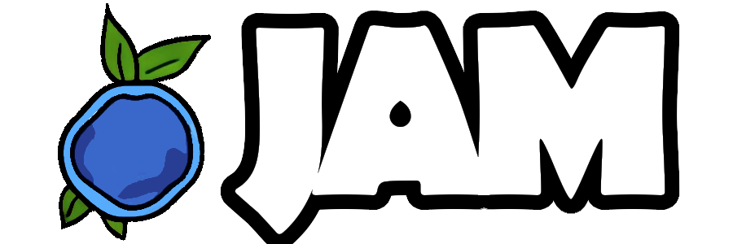

# JamLang 

### Description:

The Jam Programing language is a language I created for the fun of learning. 
Syntactically resembling go and zig. I have no current ambition to take over 
in the language war. If you want a good new language to use I suggest zig.
I may or may not finish this project. 

### Progress:
Currently I have the AST able to emit bytecode for mathematical expressions 
and it can run that on a __extremely__ simple 8-bit virtual machine.

### Ambitions
    - run it on a virtual machine that can support 32 and 64 bit types (like wasm)
    - have simple code generation for x86_64 architecture.
    - have a simple standard library written in the language
    - maybe make some educational programing games that use the language

sample `hello_world.jam` program that will be compilable in the future. 

    func main() i32 {
        @print("Hello, Mom.\n")
    }